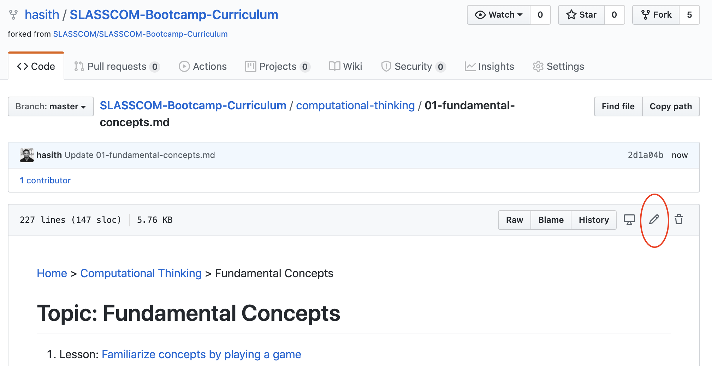
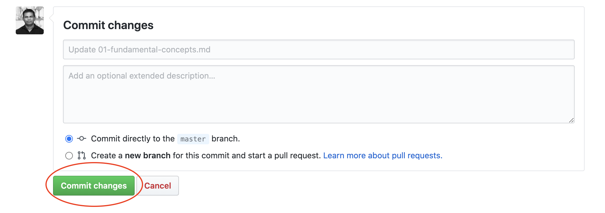
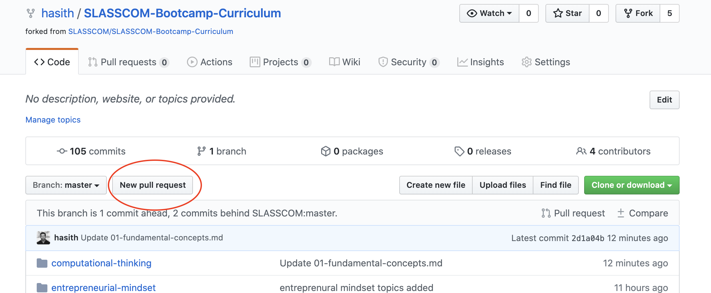

[Home](./README.md) > How to Contribute

# How to Contribute

**Before stepping-in, please ensure you have read and understood the [Underline Principles](./README.md#underline-principles) of this curriculum**

What to contribute:

- Content reviews and improvements (technical)
- Content reviews and improvements (English, presentation)
- Add/propose missing/latest content
- Develop more assignments for students
- Add further descriptions to Modules, Topics, and Lessons
- Add self study material in to Lessons

## For basic GitHub users (Edit on web UI)

Below is the community practice for you to follow in contributing to develop this curriculum via GitHub web UI.

- Create a GitHub account if you don't have one already:
  [https://github.com/](https://github.com/)

- Fork the below repository into your GiHub account.
  [https://github.com/SLASSCOM/{{repo name}}](https://github.com/SLASSCOM/{{repo name}})
  

- On the forked repository, goto the file you wish to edit, and click on the edit button.
  

- After editing a file, you should commit the changes (this is similar to saving).
  

- Edit all the files you need. Once the editing session is done you should submit your changes to the SLASSCOM repository. This is called creating a 'Pull Request'. Go to the root of your local repository and click the button as shown below to submit a pull request.
  

- You may similarly perform other file operations such as create new files, delete files, upload files, etc.

## For advanced Git/GitHub users (Edit via cloning)

Below is the community practice for you to follow in contributing to develop this curriculum via cloning the files to your local machine.

- Create a GitHub account if you don't have one already:
  [https://github.com/](https://github.com/)

- Fork the below repository into your GiHub account.
  [https://github.com/SLASSCOM/{{repo name}}](https://github.com/SLASSCOM/{{repo name}})

- Install Git and clone the repository to your local machine

  `git clone https://github.com/<your_username></your_username>/{{repo name}}`

- Add 'upstream' repo to your local cloned git repository so that you are able to obtain the latest directly from the 'upstream'.

  `git remote add upstream https://github.com/SLASSCOM/{{repo name}}.git`

- Do edits to .md files by cloning your fork to the local machine using an IDE.
- Always take a pull from 'upstream' before sending a pull request with following command. This will help reduce merge conflicts and increase the chance of your pull requests getting accepted.

  `git pull upstream master`

- Submit a pull request to the [upstream repo](https://github.com/SLASSCOM/{{repo name}}) via GitHub web UI of your fork.
- A moderator will attend to your pull request and accept, reject or request for changes.
